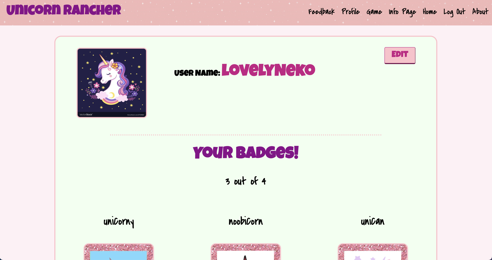
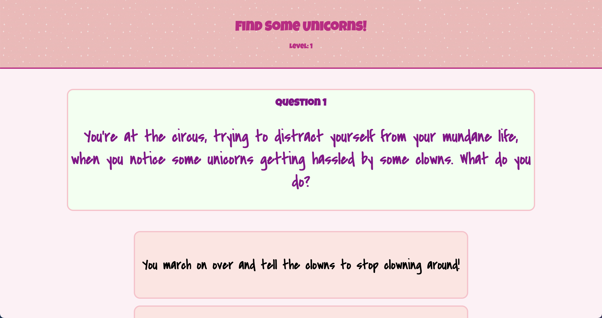
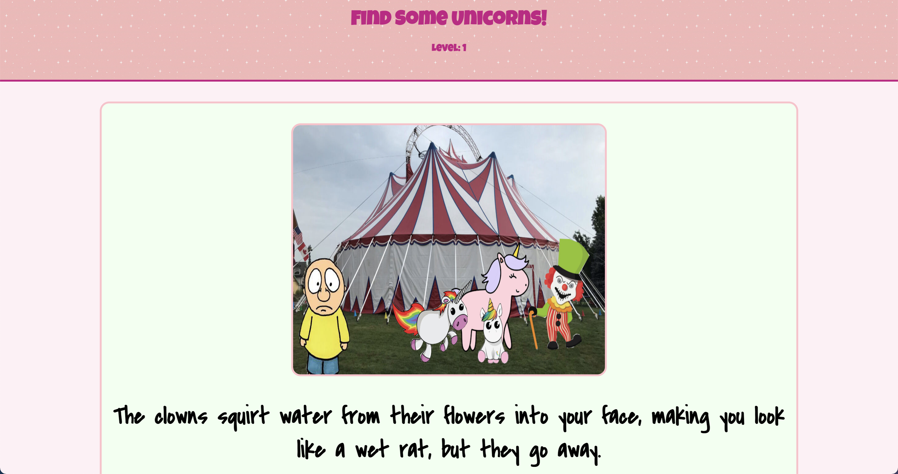
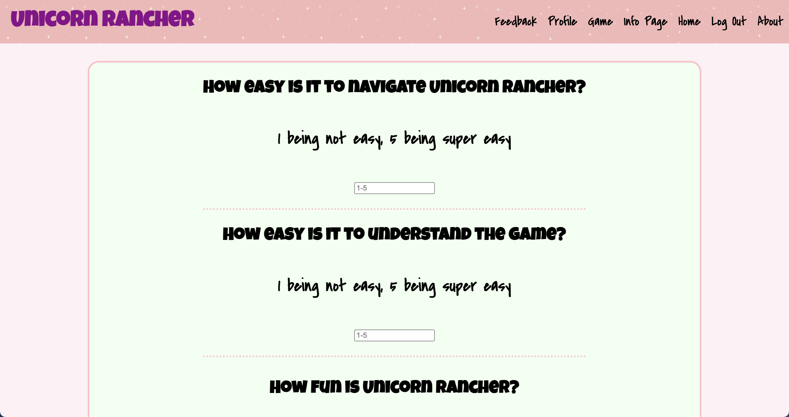

# Unicorn Rancher 

Do you wish that life was more simple? Do you feel like you should be rewarded answering easy questions? Wouldn't life be a little better with some sparkle? Unicorn Rancher is simple, fun, and adds some sparkle to your life! All you have to do is answer some simple unicorn questions to recieve an amazing badge. Be the best Unicorn Rancher by collecting all the badges!

# Game

Unicorn Rancher is a question based game. Every question is random, so each game is different.  You have 4 answers to choose from, and there is no wrong answer! All you have to do is answer 3 questions to recieve a badge!
    
# Profile

Your profile pic and user name are located in your profile. Feel to change them with the edit button. You can also delete your profile with the edit button, but we don't recommend that! Also you can find all the badges you've earned in your profile.

# Badges

Badges are what you earn after completing a game. There are 4 different badges that can be awarded. You most definitly want to collect all of them!

# Feedback

Fill out a short survey about Unicorn Rancher. The first three questions ask for a rating from 1 to 5. The last question asks for any comments.  We Would love to hear your feedback!

# Description

Unicorn Rancher uses React, Redux, and Saga.  It uses Axios to communicate from client side to server and PG for server side to database. It uses Passport to protect user infomation. All styling was done with CSS.  There is an admin side where feed back and all players can be viewed. 

# Whats Next?

Unicorn Rancher will need to be reformatted with responsive design to make it desktop and mobile friendly.

# Pictures

Profile

Question

Response

Feedback

